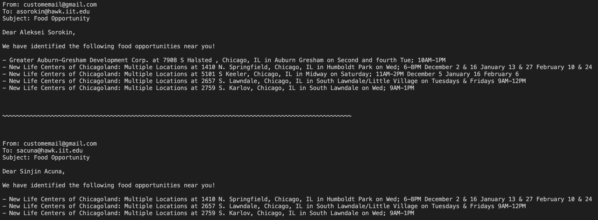

# CSW Hackathon: Mobile Food Bank Alert System

By Aleksei Sorokin [asorokin@hawk.iit.edu](mailto:asorokin@hawk.iit.edu) and Sinjin Acuna [sacuna@hawk.iit.edu](mailto:sacuna@hawk.iit.edu). Please feel free to contact us with any quesitons!

## Purpose

Running the `main.py` file will draft an email to users who are within a certain radius of a mobile food bank shown on the [Greater Chicago Food Depository website](https://www.chicagosfoodbank.org/find-food/covid-19-neighborhood-sites/). The program assumes users have set their radius preferences and the data has been collected already (see `data/users.csv`). The drafted email can then be sent out manually or automatically with the drafted fields (see [Sending Emails with Python by *RealPython*](https://realpython.com/python-send-email/) for more info on how this may be done). You can run `main.py` anytime the website is updated to get new emails drafts to subscribers.

## Usage

You can create our python environment to reproduce our work using a conda environment and the `environment.yml` file.

To load the drafted emails, you can use the Python commands

```python
import pickle
with open ('data/emails.pkl', 'rb') as fp:  emails = pickle.load(fp)
```

The variables emails now contains a list of email drafts which may be parsed and sent with the developers desired program.

The draft emails (based on our toy-example users) are printed out nicely below. 

